<!-- TEMPLATE: replace every <placeholder>, delete these TEMPLATE comments, then remove sections that do not apply. -->

# <product-name>

[](https://github.com/Lodestar-sec/<repo>/actions/workflows/ci.yml)
[](https://github.com/Lodestar-sec/<repo>/actions/workflows/security-baseline.yml)
[](https://scorecard.dev/viewer/?uri=github.com/Lodestar-sec/<repo>)
[](LICENSE)

> <One sentence: what it does and for whom.>

## Problem

<!-- TEMPLATE: 3–5 sentences. Describe the pain in the real world, who feels it, and what it costs today.
     Describe the situation, not the solution. -->

## Targets

<!-- TEMPLATE: every target must be measurable. Update "Current" with real numbers as the product matures. -->

| Target | Goal | Current | How it is measured |
|---|---|---|---|
| <e.g. Pipeline overhead> | <≤ 3 min> | — | <CI job duration, p95 over 30 runs> |
| <e.g. False-positive blocks> | << 5%> | — | <blocked PRs later marked as false positive / total blocked PRs> |
| OpenSSF Scorecard | ≥ 7.0 | — | Scorecard badge |

## Non-goals

<!-- TEMPLATE: what this product deliberately does not do. This is as important as the goals. -->

- <e.g. Replacing a full ASPM platform>

## Architecture

```mermaid
flowchart LR
    A[<input>] --> B[<component>] --> C[<output>]
```

<!-- TEMPLATE: one diagram and a short paragraph. Details go in docs/03-architecture.md. -->



## Quickstart

```bash
make demo   # <starts the app, database, and sample data locally with docker compose>
```

## Delivery

Every pull request builds the image, scans it, deploys the Helm chart to an ephemeral kind cluster, runs Helm tests and an OWASP ZAP baseline scan, then tears the cluster down. Every merge to `main` publishes a multi-arch image that is signed with Cosign and carries SBOM and SLSA provenance attestations. Every `vX.Y.Z` tag re-verifies that exact image in a clean cluster that rejects unsigned images, then publishes the version tag, a signed Helm chart, and a GitHub release.

Verify a release yourself:

```bash
cosign verify ghcr.io/lodestar-sec/<repo>:<version> \
  --certificate-identity https://github.com/Lodestar-sec/<repo>/.github/workflows/ci.yml@refs/heads/main \
  --certificate-oidc-issuer https://token.actions.githubusercontent.com
gh attestation verify oci://ghcr.io/lodestar-sec/<repo>:<version> --repo Lodestar-sec/<repo>
```

## Documentation

The product is built through a phase-gated lifecycle — see the [documentation index](docs/README.md) for every phase, its gate, and its status.

| Document | Purpose |
|---|---|
| [Charter](docs/00-charter.md) · [Requirements](docs/01-requirements.md) | Why the product exists and what it must do |
| [Technology selection](docs/02-tech-selection.md) · [ADRs](docs/adr/) | What it is built with, and why |
| [Architecture](docs/03-architecture.md) · [Data model](docs/04-data-model.md) | How it is built |
| [Threat model](docs/05-threat-model.md) | What can go wrong, and what we do about it |
| [Engineering standards](docs/06-engineering-standards.md) | How we work: tests, reviews, CI/CD |
| [Verification](docs/08-verification.md) | Evidence that it meets its requirements |
| [Runbook](docs/09-runbook.md) | Operating the product |
| [Changelog](CHANGELOG.md) | Release history |

## Security

Please report vulnerabilities privately — see the [security policy](https://github.com/Lodestar-sec/.github/blob/main/SECURITY.md).

## License

[Apache License 2.0](LICENSE)
