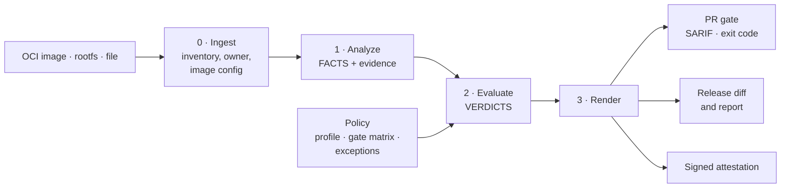

# Binary Hardening Gate *(working title)*

> Know the hardening state of every ELF binary you ship, catch regressions before release, and prove it to customers with evidence anyone can re-check.

> [!NOTE]
> **Status: Phase 0 — Inception.** There is no code yet. The charter and the policy decisions are drafted, and the research that must confirm the problem is [pre-registered](docs/research/phase-0-plan.md) and about to start. Everything below describes the intended product; the research may change it.

## Problem

Vendors that ship self-hosted software — EDR agents, network appliances, databases distributed as containers — are asked by customers, pentesters, and regulators (EU CRA) whether their binaries are built with exploit mitigations such as PIE, RELRO, stack canaries, and CET/BTI.

Today the answer usually comes from running `checksec` by hand on a few main binaries and pasting the output into a spreadsheet. Shared libraries and third-party binaries are skipped, although one image can hold more than a thousand ELF files. A base-image upgrade, a compiler change, or a vendored Makefile can silently drop a mitigation between releases, and a spreadsheet gives customers nothing they can verify.

These claims are **hypotheses until measured** — see [Phase 0 research](#phase-0-research).

## What makes it different

- **Facts, then verdicts.** The engine records what is in the binary; policy decides what it means. A policy change never requires a rescan, and a diff says whether a verdict changed because the *binary* changed or the *policy* did ([ADR 0002](docs/adr/0002-staged-pipeline-facts-then-verdicts.md)).
- **Three states, never guessed.** Every property is `present`, `absent`, or `undeterminable` — with a reason — instead of reporting "no canary" on a stripped static binary.
- **Evidence anyone can re-check.** Every conclusion points to the bytes it came from and a `readelf` command that reproduces it, so customers do not have to trust the tool ([charter §5](docs/00-charter.md#5-evidence-model)).
- **Every finding has an owner.** Files are attributed to your build, a distro package, or a third-party package, so a finding goes to whoever can act on it ([ADR 0005](docs/adr/0005-ownership-detection.md)).
- **A gate teams keep.** The PR gate blocks only regressions, only on certain evidence; new binaries must meet `strict`; exceptions expire ([ADR 0004](docs/adr/0004-gate-rules-and-matrix.md), [ADR 0006](docs/adr/0006-exceptions.md)).

## Intended architecture

One pipeline, four stages. Stage 1 never reads policy; stage 2 never reads file bytes.

Design details will live in [docs/03-architecture.md](docs/03-architecture.md) once phase 3 starts.

## Targets

From the [charter](docs/00-charter.md#6-objectives-and-success-metrics). Baselines are measured in Phase 0.

| Target | Goal | Current | How it is measured |
|---|---|---|---|
| ELF files in a release with a result (incl. `undeterminable` with reason) | 100% | — | Results vs. ELF files found by magic bytes |
| Conclusions reproducible with binutils | 100% of `present`/`absent` | — | CI replays every reproduce command on the test corpus |
| Gate false-positive rate | < 2% | — | Blocks confirmed wrong on the corpus and real PRs |
| Time to answer a questionnaire's hardening section | < 1 hour | — (baseline in Phase 0) | Timed walkthrough |
| OpenSSF Scorecard | ≥ 7.0 | — | Scorecard badge |

## Non-goals

- Finding vulnerabilities in source code (SAST, fuzzing) or CVEs in packages (Trivy, Grype).
- Reverse engineering, disassembly, or decompilation (Ghidra, IDA).
- Generating exploits or executing the binaries it analyzes.
- Assessing the kernel or container runtime — the kernel is a stated assumption in every report.

## Phase 0 research

Before any code, the problem itself is tested. The research asks three questions, each split into falsifiable hypotheses with thresholds fixed **before** data collection (tag [`phase-0-prereg`](https://github.com/Lodestar-sec/binary-hardening-gate/tree/phase-0-prereg)):

1. **What** — is the problem real and material? (gaps, regressions between releases, whether they go unnoticed)
2. **Why** — is hardening lost when it is *introduced* (distro, toolchain, build configuration, language defaults) or when it is *not detected*?
3. **So what** — can a binary-level, evidence-based gate actually solve it?

| Document | Content |
|---|---|
| [Research plan](docs/research/phase-0-plan.md) | Process, issue tree, hypotheses, evidence standard, logs |
| [Measurement protocol](docs/research/phase-0-protocol.md) | Operational definitions: ELF fields, counting rules, thresholds |
| [Research workspace](research/phase-0/) | Toolbox, sample, and append-only logs |

A result that contradicts the charter is a success of this phase: the charter changes before the code does.

## Roadmap

Estimates assume about two hours of work per week and are revised at every gate.

| Milestone | Outcome | Target | Status |
|---|---|---|---|
| Phase 0 | Charter approved; problem measured on public images | 2026-10 | 🟨 In progress |
| Phases 1–5 | Requirements, technology selection, architecture, data model, threat model | 2027-01 | ⬜ |
| Walking skeleton | First commit through the full pipeline | 2027-02 | ⬜ |
| v0.1 — CLI | `scan`, `compare`, `explain`; structural ELF checks; PR gate with SARIF | 2027-06 | ⬜ |
| v0.2 — Service | Snapshot history, release diff, full OCI layer handling, effective protection | 2027-11 | ⬜ |

## Documentation

The product follows the organization's phase-gated lifecycle — see the [documentation index](docs/README.md) for every phase and its gate.

| Document | Status |
|---|---|
| [Charter](docs/00-charter.md) | 🟨 Draft |
| [ADRs](docs/adr/) — pipeline, profiles, gate, ownership, exceptions, toolchain | ✅ 0002–0007 accepted |
| [Phase 0 research plan](docs/research/phase-0-plan.md) · [protocol](docs/research/phase-0-protocol.md) | ✅ Pre-registered |
| [Requirements](docs/01-requirements.md) · [Technology selection](docs/02-tech-selection.md) · [Architecture](docs/03-architecture.md) · [Data model](docs/04-data-model.md) · [Threat model](docs/05-threat-model.md) | ⬜ Not started |

## Contributing

The project is in its design phase; feedback on the [charter](docs/00-charter.md) and the [research plan](docs/research/phase-0-plan.md) is the most useful contribution right now. See the [contributing guide](https://github.com/Lodestar-sec/.github/blob/main/CONTRIBUTING.md).

## Security

Please report vulnerabilities privately — see the [security policy](https://github.com/Lodestar-sec/.github/blob/main/SECURITY.md).

## License

[Apache License 2.0](LICENSE)
