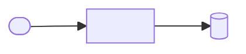
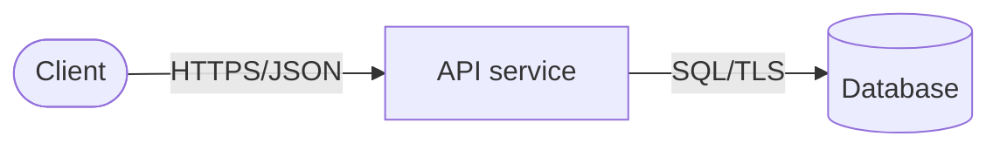

# 03 · Architecture: <product-name>

| | |
|---|---|
| **Status** | Draft · In review · Approved |
| **Last updated** | YYYY-MM-DD |

## 1. System context (C4 level 1)

<!-- The product as a single box, its users, and the external systems it talks to. -->

## 2. Containers (C4 level 2)

<!-- Deployable units: API, worker, database, queue… with technology and protocol on each arrow. -->

| Container | Responsibility | Technology (ADR) | Scales by |
|---|---|---|---|
| | | | |

## 3. Components (C4 level 3)

<!-- Internal structure of the main container: modules/layers and their dependencies.
     Dependencies must point inward: domain logic never depends on frameworks or infrastructure. -->

## 4. API design

- **Contract:** OpenAPI 3.1 in `api/openapi.yaml` — the contract is written before the implementation.
- **Versioning:** URI prefix (`/v1`); breaking changes require a new major version.
- **Errors:** RFC 9457 Problem Details (`application/problem+json`), no stack traces or internal identifiers.
- **Pagination:** cursor-based for collections that can exceed 100 items.
- **Idempotency:** unsafe operations that clients may retry accept an `Idempotency-Key` header.

## 5. Cross-cutting concerns

| Concern | Approach |
|---|---|
| Authentication | |
| Authorization | Deny by default; checked server-side on every request |
| Configuration | Environment variables (12-factor); validated at startup; no secrets in images |
| Logging | Structured JSON to stdout, correlation ID on every entry, no secrets or personal data |
| Metrics | RED metrics (rate, errors, duration) in Prometheus format |
| Health | `/healthz` (liveness: process only) and `/readyz` (readiness: includes dependencies) |
| Error handling | |
| Consistency and concurrency | |

## 6. Deployment view

- Packaged as a signed, multi-arch OCI image and a Helm chart (`deploy/helm`).
- Runs as non-root with a read-only root filesystem, all capabilities dropped, and a restrictive NetworkPolicy.
- Every pull request deploys the chart to an ephemeral kind cluster; every release is re-verified in a clean cluster with signature enforcement.

## 7. NFR → mechanism

| NFR | Architectural mechanism |
|---|---|
| NFR-001 | |

## Gate checklist

- [ ] C4 levels 1–3 are drawn and consistent with each other
- [ ] Every container's technology links to an ADR
- [ ] Every NFR maps to a mechanism
- [ ] API contract drafted in `api/openapi.yaml`
