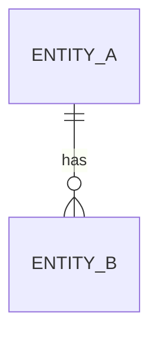

# 04 · Data model: <product-name>

| | |
|---|---|
| **Status** | Draft · In review · Approved |
| **Database** | <engine and version> — see [ADR-](adr/) |
| **Last updated** | YYYY-MM-DD |

## 1. Data inventory and classification

| Data | Source | Classification | Personal data? | Retention |
|---|---|---|---|---|
| | | Public · Internal · Confidential · Restricted | Yes / No | |

## 2. Conceptual model

<!-- Business entities and relationships only — no types, no keys. -->

## 3. Logical model

- Normalized to **third normal form (3NF)**.
- Every deviation (denormalization, JSON columns, materialized views) is listed below with its reason.

| Deviation | Reason (requirement ID) | How consistency is maintained |
|---|---|---|
| | | |

## 4. Physical model

### Naming conventions

- `snake_case` for all identifiers; table names are plural nouns.
- Primary key column `id`; foreign keys named `<referenced_table_singular>_id`.
- Every table has `created_at` and `updated_at` (`timestamptz`, UTC).
- Constraint names: `pk_<table>`, `fk_<table>_<column>`, `uq_<table>_<columns>`, `ck_<table>_<rule>`, index names `ix_<table>_<columns>`.

### Tables

#### `<table_name>`

| Column | Type | Null | Default | Constraint | Notes |
|---|---|---|---|---|---|
| `id` | | No | | PK | |
| `created_at` | `timestamptz` | No | `now()` | | |
| `updated_at` | `timestamptz` | No | `now()` | | |

- **Foreign keys:** <column> → <table>(<column>), `ON DELETE <RESTRICT | CASCADE | SET NULL>` — reason:
- **Checks:**
- **Unique:**

## 5. Business rules enforced in the database

<!-- Rules the application must never be able to violate, even with a bug. -->

| Rule | Enforcement (constraint, trigger, exclusion, RLS) |
|---|---|
| | |

## 6. Query catalog and indexes

<!-- Every core query from the requirements must be listed with its supporting index. -->

| ID | Query (purpose) | Frequency | Latency target | Supporting index |
|---|---|---|---|---|
| Q-001 | | | | |

## 7. Audit and history

<!-- How changes are recorded: append-only audit table, temporal tables, event log. Who can read it; can it be altered? -->

## 8. Database security

| Control | Implementation |
|---|---|
| Roles | `<app>_migrator` (DDL, used only by migrations) · `<app>_app` (DML on owned tables) · `<app>_readonly` (reporting) |
| Least privilege | The application role cannot run DDL or read tables it does not need |
| Encryption in transit | TLS required for every connection |
| Encryption at rest | |
| Row-level security | |
| Credentials | Injected at runtime from a secret store; rotated every <N> days |

## 9. Migrations

- Tool: <tool> — see [ADR-](adr/).
- Every migration is versioned, reviewed, and runs in CI against a real database.
- Schema changes follow **expand → migrate → contract**, so the previous application version keeps working during a rollout.
- Down migrations are tested in CI; production rollback prefers a forward fix.

## 10. Backup and recovery

| Metric | Target |
|---|---|
| RPO (maximum data loss) | |
| RTO (maximum downtime) | |
| Backup method and frequency | |
| Restore test | Automated restore test in CI or scheduled workflow |

## 11. Capacity estimate

| Table | Rows (1 year) | Avg row size | Size incl. indexes |
|---|---|---|---|
| | | | |

## Gate checklist

- [ ] Every table is in 3NF or its deviation is justified
- [ ] Every foreign key has an explicit `ON DELETE` rule with a reason
- [ ] Every business rule that can be enforced in the database is
- [ ] Every core query has a supporting index
- [ ] Data classification and retention are defined for every data item
- [ ] Least-privilege database roles are defined
- [ ] RPO and RTO are defined
