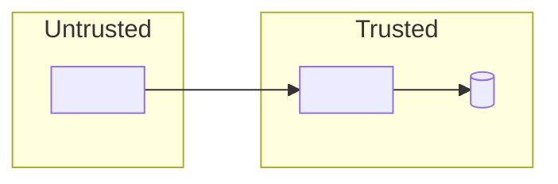

# 05 · Threat model: <product-name>

| | |
|---|---|
| **Method** | STRIDE per element |
| **Last reviewed** | YYYY-MM-DD |
| **Review cadence** | Every minor release, and whenever a trust boundary changes |

## 1. Scope

<!-- What is in scope (components, deployment model) and what is not. -->

## 2. Assets

<!-- What an attacker wants: credentials, tokens, findings data, signing keys, CI runners, the ability to bypass a gate… -->

| Asset | Why it matters | Sensitivity |
|---|---|---|
| | | High / Medium / Low |

## 3. Trust boundaries and data flow

## 4. Threats

| ID | Element | STRIDE | Threat | Likelihood | Impact | Mitigation | Status |
|---|---|---|---|---|---|---|---|
| T1 | | Spoofing | | | | | Open / Mitigated / Accepted |
| T2 | | Tampering | | | | | |
| T3 | | Repudiation | | | | | |
| T4 | | Information disclosure | | | | | |
| T5 | | Denial of service | | | | | |
| T6 | | Elevation of privilege | | | | | |

## 5. Accepted risks

<!-- Risks consciously not mitigated, with justification, owner, and review date. -->

| Threat ID | Justification | Owner | Review by |
|---|---|---|---|
| | | | |

## Gate checklist

- [ ] Data flow diagram matches the architecture in `03-architecture.md`
- [ ] Every element crossing a trust boundary was analysed against all six STRIDE categories
- [ ] Every High threat is mitigated or accepted with an owner and review date
- [ ] Every mitigation is traceable to a security requirement (`SR-`) or an ADR
