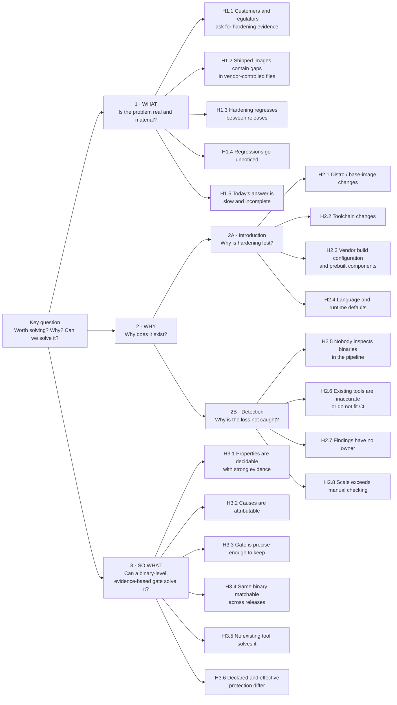
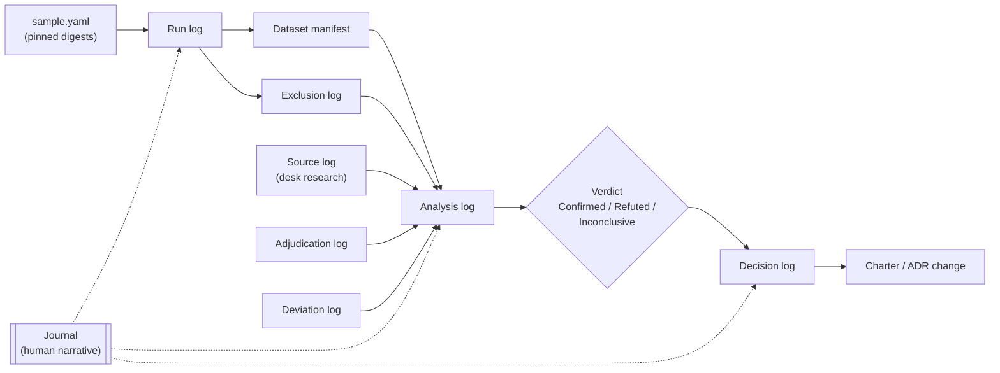

# Phase 0 research plan: from problem, to cause, to evidence

| | |
|---|---|
| **Status** | Pre-registered 2026-09-23 — awaiting tag `phase-0-prereg` |
| **Owner** | @Lewall-theart |
| **Last updated** | 2026-09-23 |
| **Budget** | P0 ~16 h (~8 weeks at 2 h/week); P1 +6 h |
| **Feeds** | [Charter §1](../00-charter.md#1-problem-statement), [§6](../00-charter.md#6-objectives-and-success-metrics), and ADRs [0002](../adr/0002-staged-pipeline-facts-then-verdicts.md)–[0007](../adr/0007-strict-toolchain-adjustment.md) |

## 1. The process

The research follows a fixed, hypothesis-driven process. No step starts before the previous one is written down.

| # | Step | Output | Rule | Log (§12) |
|---|---|---|---|---|
| 1 | **Frame** the problem | Situation, complication, key question (§2) | Describes the situation, not the solution | Journal |
| 2 | **Decompose** the key question | Issue tree (§3) | Branches are mutually exclusive and collectively exhaustive (MECE) | Journal |
| 3 | **Hypothesize** | One falsifiable hypothesis per leaf (§4) | Each states a prediction that data could prove wrong | Journal |
| 4 | **Pre-register** | Thresholds and decision rules committed to git *before* any data is collected | Changes after collection are logged as deviations, never silently applied | Deviation log |
| 5 | **Collect** | Measurements from the instrument catalogue (§6) | Reproducible, pinned by digest, no binary is ever executed | Run log, exclusion log, dataset manifest, source log |
| 6 | **Adjudicate** | Manual verification of samples with `readelf` (§5.4) | Automated numbers are not trusted alone | Adjudication log |
| 7 | **Conclude** | Verdict per hypothesis with evidence grade (§5) | Confirmed / Refuted / Inconclusive — never "probably" | Analysis log |
| 8 | **Drill down** | Next "why" for each dominant cause (§4.2) | Stop rule defined in advance | Journal, deviation log (new hypotheses) |
| 9 | **Decide** | Charter and ADR changes from the decision rules | Every change cites the hypothesis that caused it | Decision log |
| 10 | **Review** | Gate PR with findings | A claim without a verdict is removed from the charter | Decision log |

**No step is complete until its log entry exists.** A number, verdict, or decision that cannot be traced through the logs to its inputs is treated as if it did not exist.

## 2. Problem framing

- **Situation.** Vendors ship self-hosted software as container images containing hundreds to thousands of ELF files. Customers, pentesters, and regulators ask whether these binaries are built with exploit mitigations.
- **Complication.** Vendors cannot answer completely or verifiably, and mitigations may disappear between releases without anyone noticing.
- **Key question.** *Is there a problem worth solving here, why does it exist, and can a binary-level, evidence-based gate solve it?*

## 3. Issue tree

The key question splits into **what**, **why**, and **so what**. Branch 2 rests on one logical identity that makes it MECE:

> A hardening regression reaches a release **if and only if** it is *introduced* **and** it is *not detected*.

So every cause is either an introduction cause (2A) or a detection cause (2B).



Branch 1 must be confirmed for the product to exist. Branch 2 tells us **which persona and which feature** matter most. Branch 3 tells us **whether our approach works** — and each refuted H3 amends a specific ADR.

## 4. Hypotheses, predictions, and decision rules

Thresholds are **proposals** until pre-registered (§1 step 4). Every term below — *non-distro file*, *regression*, *fails `standard`*, *certain evidence*, *same binary*, *mentioned* — has an operational definition in the **[measurement protocol](phase-0-protocol.md)**, whose §14 is the binding version of these thresholds. "Non-distro files" means files not owned by a distro package — the closest observable proxy for vendor code in public images. Only facts with *certain* evidence count toward a threshold unless stated otherwise.

### 4.1 Branch 1 — Is the problem real and material?

| ID | Hypothesis | Falsifiable prediction (proposed threshold) | Measurements | Min. grade | If confirmed | If refuted |
|---|---|---|---|---|---|---|
| H1.1 | Customers and regulators ask vendors for hardening evidence | EU CRA Annex I contains a requirement covering exploitation mitigation, **and** ≥ 3 of 10 sampled vendors publicly address binary hardening (trust page, whitepaper, questionnaire answer) | M23 | B | Output contract (charter §4) stands | Attestation and questionnaire export move after v0.2; lead with regression prevention |
| H1.2 | Shipped images contain gaps in vendor-controlled files | In ≥ 3 of 10 products, ≥ 10% of non-distro ELF files fail ≥ 1 `standard` requirement | M01, M03, M04 | A | Problem statement §1 keeps "gaps" | Gaps are rare; product value rests on H1.3 and H1.1 only |
| H1.3 | Hardening regresses between releases | ≥ 1 regression in ≥ 6 of 30 consecutive release pairs (10 products × 3 pairs) | M05, M06, M15 | A | Core claim stands | **Reposition:** lead with *prove* (evidence, attestation) instead of *prevent regressions* |
| H1.4 | Regressions go unnoticed | ≥ 70% of regressions found in H1.3 are not mentioned in the release notes, changelog, or issue tracker of that release | M20 (P0), M19 (P1) | A | "Silent" stays in §1 | Replace "silent" with the observed detection path; the value becomes speed, not discovery |
| H1.5 | Today's answer is slow and incomplete | A full-coverage answer to the four questionnaire properties takes > 60 min for one image with existing tools, **or** coverage in 30 min is < 20% of ELF files | M22, M01 | A | Sets the §6 baseline | *Prove* objective downgraded |

### 4.2 Branch 2 — Why does it exist?

**2A — Introduction.** Every regression and gap in non-distro files is attributed to exactly one cause (M07). A cause is **dominant** if it explains ≥ 50% of attributed cases, **contributing** at ≥ 15%, **refuted** below 15%.

| ID | Hypothesis | Prediction | Measurements | Min. grade | Decision if dominant or contributing |
|---|---|---|---|---|---|
| H2.1 | Distro / base-image changes | Share of cases coinciding with a distro package version change or base-image digest change | M07, M09 | A | P2 (Platform) is the primary persona; base-image diff is the lead feature |
| H2.2 | Toolchain changes | Share of cases coinciding with a change in `.comment` compiler version or Go/Rust version | M07, M08, M10 | A | Toolchain attribution in the diff is a v0.1 feature |
| H2.3 | Vendor build configuration and prebuilt components | Share of cases in non-distro files with no distro or toolchain change, or where a newly vendored component appears | M07, M08 | A | P3 (developer) gate is the lead feature; fix snippets per build system are essential |
| H2.4 | Language and runtime defaults | Share of gaps explained by language default (e.g. Go build mode) | M04, M07 | A | Language-aware policy is essential in v0.1 |

**2B — Detection.**

| ID | Hypothesis | Falsifiable prediction (proposed threshold) | Measurements | Min. grade | If confirmed | If refuted |
|---|---|---|---|---|---|---|
| H2.5 | Nobody inspects binaries in the pipeline | ≤ 2 of 10 sampled products run any ELF hardening check in their public CI configuration | M21 | A | The gap is *absence of a step*: make adoption trivial (one CI step) | The gap is *quality of the step*: compete on H2.6 |
| H2.6 | Existing tools are inaccurate or do not fit CI | For ≥ 1 property, tools disagree on ≥ 5% of files, **and** manual adjudication shows the most-used tool wrong on ≥ 50% of disagreements in the named cases (Go, musl FORTIFY, stripped static, PIE vs. shared library) | M12, M24 | A | Three-state results and language awareness are core differentiators | Drop the accuracy claim from §1; differentiate on ownership, diff, evidence |
| H2.7 | Findings have no identifiable owner | ≥ 20% of non-distro ELF files have no owner determinable from in-image signals | M03 | A | Ownership map is a v0.1 onboarding step | Ownership is mostly automatic; simplify ADR 0005 |
| H2.8 | Scale exceeds manual checking | Median ELF count per product image ≥ 200 | M01, M02 | A | §1 scale claim stands | Scale is not the driver; drop it |

**Drill-down rule (5 whys).** For each cause confirmed as **dominant**, ask the next "why" and add a hypothesis one level down (e.g. H2.3 → *why do vendor builds lose flags: overridden `CFLAGS`, prebuilt third-party binaries, static linking?*), measured with the finest available instrument (M08, annobin, DWARF producer). **Stop** when either (a) the cause is actionable by one persona, or (b) the best available evidence falls below grade B.

### 4.3 Branch 3 — Can our approach solve it?

| ID | Hypothesis | Falsifiable prediction (proposed threshold) | Measurements | Min. grade | If confirmed | If refuted — ADR impact |
|---|---|---|---|---|---|---|
| H3.1 | Properties are decidable with strong evidence | For each `strict` property, ≥ 90% of non-distro files are decidable with *certain* or *high* evidence; `.comment` is present in ≥ 50% of non-distro files | M10, M11 | A | Three-state model and ADR 0007 stand | Properties below 90% leave `strict` (new ADR superseding 0003); `.comment` below 50% → revisit ADR 0007 |
| H3.2 | Causes are attributable from in-image signals | ≥ 60% of regressions attributed to one cause with grade-A signals | M07 | A | Cause attribution is promised in the diff | Diff reports *what* changed, not *why*; P2 value reduced |
| H3.3 | A gate can be precise enough to keep | In policy simulation, < 2% of `block` decisions are wrong on manual review, **and** median blocks per release pair ≤ 5 on non-distro files | M16 | A | ADR 0003/0004 defaults stand; §6 target confirmed | Tighten evidence rules or change matrix defaults (new ADR superseding 0004) |
| H3.4 | The same binary can be matched across releases | The best identity key matches ≥ 95% of files present in both releases with ≤ 1% false matches | M15 | A | Diff key chosen | Composite key needed; **new ADR superseding 0006** (exceptions bound to path) |
| H3.5 | No existing tool already solves it | No tool in the capability matrix covers all of: image input, three-state results, ownership, release diff, verifiable evidence | M24 | B | Differentiation stated in charter | Contribute to or build on the existing tool instead of starting a new one |
| H3.6 | Declared and effective protection differ | ≥ 5% of executables declaring SHSTK or BTI lose it through a library in their resolved closure | M13, M14 | A | Effective analysis stays in scope | Effective analysis moves after v0.2 |

## 5. Evidence standard

### 5.1 Evidence grades

| Grade | Source | Example | Can confirm a hypothesis? |
|---|---|---|---|
| **A** | Reproducible measurement from the study dataset: dataset version, query, and a `readelf` reproduce command | "12 of 30 release pairs contain a regression" + script + rows | Yes |
| **B** | Primary document, quoted with location | Regulation clause, official release notes, tool source code | Yes |
| **C** | Secondary source | Papers, blog posts, vendor marketing | Only *supports* |
| **D** | Anecdote | Practitioner conversation | Only *supports* |

The research eats its own cooking: every grade-A number links to the rows that produced it and to a command anyone can re-run, exactly as the product's evidence model requires ([charter §5](../00-charter.md#5-evidence-model)).

### 5.2 Verdicts

- **Confirmed** — prediction met with evidence at or above the minimum grade.
- **Refuted** — prediction not met with evidence at or above the minimum grade.
- **Inconclusive** — evidence below the minimum grade, or sample too small. Must state the reason and the next step.

### 5.3 Pre-registration

Before step 5, §4 of this plan **and** the [measurement protocol](phase-0-protocol.md) (except its appendix A, completed in T1 before any comparison runs) are frozen in a commit and tagged `phase-0-prereg`. Any change afterwards is recorded in the findings as a **deviation**: what changed, why, and what the verdict would have been under the original rule.

### 5.4 Adjudication

- Every hypothesis verdict that depends on automated classification is checked on a random sample (at least 30 cases, or all if fewer) with `readelf`, by hand, and logged in `research/phase-0/adjudication.csv`.
- If the manual check disagrees with the automated result in > 5% of the sample, the automated measurement is fixed and re-run before any verdict.

### 5.5 Traceability

| Charter claim or ADR | Hypotheses |
|---|---|
| §1 "Coverage is partial" | H1.5, H2.8 |
| §1 "Regressions are silent" | H1.3, H1.4, H2.5 |
| §1 "Answers are not verifiable" | H1.1, H3.5 |
| §1 "Existing tools report per file and declared flags only" | H2.6, H3.5, H3.6 |
| Personas P1 / P2 / P3 priority | H1.1, H2.1–H2.4 |
| ADR 0002 (cache by content hash) | M02 under H2.8 |
| ADR 0003 (profiles) | H3.1 |
| ADR 0004 (gate) | H3.3 |
| ADR 0005 (ownership) | H2.7 |
| ADR 0006 (exceptions bound to path) | H3.4 |
| ADR 0007 (toolchain adjustment) | H3.1 (`.comment` availability) |

A charter claim with no hypothesis, or whose hypotheses are all refuted, is removed at step 9.

## 6. Instrument catalogue

Measurements are instruments; hypotheses decide what they mean.

| ID | Measurement | Feeds | Priority |
|---|---|---|---|
| M01 | ELF inventory by magic bytes; classification (`exec`, `pie`, `shared_lib`, `static`, `static_pie`) | H1.2, H1.5, H2.8 | P0 |
| M02 | Content-hash deduplication across images | H2.8, ADR 0002 | P0 |
| M03 | Ownership per file, signal used, package integrity check | H1.2, H2.7 | P0 |
| M04 | Declared property prevalence by owner, distro, language, libc | H1.2, H2.4 | P0 |
| M05 | Release churn: added, removed, changed, unchanged files | H1.3 | P0 |
| M06 | Regression detection per release pair | H1.3 | P0 |
| M07 | Cause attribution per regression and gap | H2.1–H2.4, H3.2 | P0 |
| M08 | Toolchain mosaics (several compilers in `.comment`) | H2.2, H2.3 | P1 |
| M09 | Deviation of distro files from distro default flags | H2.1 | P1 |
| M10 | Evidence availability per property (stripped, `.comment`, build-id, annobin, DWARF, Go build info) | H2.2, H3.1 | P0 |
| M11 | Debug-info recovery via public debuginfod, by build-id only | H3.1 | P1 |
| M12 | Tool agreement matrix and manual adjudication | H2.6 | P0 |
| M13 | Library graph inside the image root (resolution, search paths, runtime-loaded modules, loader settings) | H3.6 | P1 |
| M14 | Declared vs. effective CET/BTI and executable-stack requests in closures | H3.6 | P1 |
| M15 | Identity-key stability across releases (path, soname, package + path, build-id) | H1.3, H3.4 | P0 |
| M16 | Policy simulation of `standard`/`strict` and the default gate matrix, with manual review | H3.3 | P0 |
| M17 | Anomalous or malformed ELF files; size and section-count maxima | Threat model input | P1 |
| M18 | Frequency of compiler × libc × language combinations | Test corpus design | P1 |
| M19 | Public tracker mining: detection lag and discoverer of hardening regressions | H1.4 | P1 |
| M20 | Release notes, changelog, and issue check for each regression found in M06 | H1.4 | P0 |
| M21 | Public CI configuration survey of sampled products for any ELF hardening step | H2.5 | P0 |
| M22 | Timed walkthrough answering the questionnaire properties with existing tools | H1.5 | P0 |
| M23 | Demand documents: EU CRA Annex I, vendor trust pages, questionnaires, NIST SSDF, OpenSSF | H1.1 | P0 |
| M24 | Capability matrix of existing tools (checksec, `hardening-check`, `annocheck`, BinSkim, pax-utils, Syft/Trivy/Grype) | H2.6, H3.5 | P0 |
| M25 | Verification of the ADR 0007 capability table and distro default flags | H2.1, ADR 0007 | P0 |
| M26 | Prior empirical studies of hardening prevalence and regressions | Context for all | P1 |
| M27 | Practitioner conversations (3–5) | Personas, grade D support | P2 |

Desk-research rule: **primary sources only**; anything else is grade C or D.

## 7. Sample

Pin every image **by digest**. Phase 0 uses `linux/amd64`; 3 images are repeated on `linux/arm64` for M14 (BTI).

| Stratum | Size | Selection rule | Feeds |
|---|---|---|---|
| A. Base images | 6 | Debian, Ubuntu, Alpine, UBI, distroless, Wolfi — latest stable | M04, M09, M10, M18 |
| B. Self-hosted products | 10 | Container-distributed products with versioned releases and public source/CI, across categories: database, cache, proxy, observability, identity, secrets, object storage, CI, ML/CUDA (one large image) | Branch 1, 2B, 3 |
| C. Release series | 10 products × 4 consecutive releases (30 pairs) | Same products as B | H1.3, H1.4, 2A, H3.2–H3.4 |

~56 image pulls, recorded in `research/phase-0/sample.yaml` with digests. Selection requires public CI configuration (for M21) and public release notes (for M20).

## 8. Method

### 8.1 Safety rules (non-negotiable)

- **Never execute analyzed binaries.** Do **not** use `ldd`: it can run code from the binary. Use static tools only (`readelf`, `lddtree`/`scanelf` from pax-utils).
- Extract images **without starting them**: `crane export` or `skopeo copy` to an OCI layout, then unpack.
- Analyze in a throwaway Linux container with `--network none`, the filesystem mounted **read-only**, and CPU/memory limits. The only network step is M11, which sends build-ids, never files.
- **Never commit extracted binaries** (licensing). Commit only digests, scripts, derived data, and the adjudication log.

### 8.2 Dataset schema (one JSONL row per file)

| Group | Fields |
|---|---|
| Identity | `image`, `digest`, `release`, `base_image_digest`, `layer_index`, `path`, `sha256`, `size` |
| Classification | `elf_kind`, `arch`, `language`, `libc`, `soname` |
| Ownership | `owner`, `owner_signal`, `package`, `integrity_ok` |
| Evidence availability | `stripped`, `build_id`, `comment_compilers` (list), `go_version`, `rust_detected`, `annobin`, `dwarf_producer` |
| Structure | `gnu_stack_flags`, `rwx_segments`, `textrel`, `relro`, `bind_now`, `gnu_property`, `needed` (list), `rpath`, `runpath` |
| Tool results | `props.<tool>.<property>`, raw per tool |
| File system | `mode`, `setuid`, `setgid`, `capabilities` |
| Anomalies | `anomalies` (list), `section_count` |

## 9. Tasks and time budget

| Task | Content | P0 | P1 |
|---|---|---|---|
| T0 | Pre-register: review the [measurement protocol](phase-0-protocol.md), agree thresholds (protocol §14), tag `phase-0-prereg` | 1.5 h | |
| T1 | Research toolbox: Dockerfile with binutils, pax-utils, checksec, annocheck, devscripts, syft, crane | 1.0 h | |
| T2 | Sample selection, `sample.yaml` with digests | 0.5 h | |
| T3 | Collection scripts → JSONL dataset (runs unattended), with run log, exclusion log, and dataset manifest built in (§12) | 3.0 h | |
| T4 | Branch 1: M01–M06, M20, M22, M23 | 2.5 h | |
| T5 | Branch 2: M07, M12, M21, M24, M25 | 2.5 h | |
| T6 | Branch 3: M10, M15, M16 | 2.0 h | |
| T7 | Adjudication log (§5.4) | 1.0 h | |
| T8 | Findings, drill-down, charter and ADR changes, gate PR | 1.5 h | |
| — | Journal and log upkeep (~5 min per session, ~7 sessions) | 0.5 h | |
| T9 | P1 instruments: M08, M09, M11, M13, M14, M17–M19, M26 | | 6.0 h |
| | **Total** | **~16 h** | **+6 h** |

Scripts for T1 and T3 are research tooling, not the product engine; they may be drafted with assistance and are reviewed by the owner.

## 10. Threats to validity

| Threat | Effect | Mitigation |
|---|---|---|
| Public images are not proprietary vendor images | No `internal` category observable | Non-distro files as proxy; stated in every finding |
| Existing tools are both instrument and subject (H2.6) | Errors propagate | Own `readelf` probe is primary; tool results kept separate; adjudication |
| Small sample (16 products, 30 pairs) | Indicative, not population estimates | Counts with every percentage; per-product results |
| Only reported regressions are visible in trackers | Undercounts silence | H1.4 relies primarily on M20 against regressions found in our own data |
| Confirmation bias of a single researcher | Thresholds bent to fit data | Pre-registration (§5.3); deviations logged |
| Self-timed walkthrough (M22) | Researcher knows the domain better than a typical engineer | State it; treat the result as a lower bound |
| Rebuilds without source change | Wrong attribution | Base-image digest recorded; M07 classifies causes explicitly |
| Survivorship: files or images that failed to analyze silently disappear from the denominators | Percentages look better or worse than reality | Exclusion log (§12.4); every finding reports analyzed, excluded, and total counts |
| Results cannot be reproduced later (tool versions drift, tags move) | Findings cannot be re-checked | Run log records tool versions, toolbox image digest, script commit, and input digests (§12.2) |

## 11. Deliverables

- `research/phase-0/` — toolbox, `sample.yaml`, scripts, dataset, and every log in §12 (no binaries).
- `docs/research/phase-0-findings.md` — one section per hypothesis: **verdict**, evidence with grade and links, deviations, decision taken.
- Charter §1 and §6 rewritten from the verdicts; claims without a confirmed hypothesis removed.
- New ADRs superseding any ADR invalidated by Branch 3.
- Gate PR marking Phase 0 as passed.

## 12. Logs and audit trail

Every number, verdict, and decision must be traceable back to its inputs through the logs. The chain is:



The exclusion log feeds the analysis log directly, so excluded files are always counted in denominators.

### 12.1 Log inventory

| Log | Location | Written by | Format | Answers |
|---|---|---|---|---|
| Journal | `research/phase-0/journal.md` | Researcher, every session | Markdown | What was done, when, how long, what surprised us |
| Run log | `research/phase-0/runs/<run-id>/run.json` + `events.jsonl` | Collection scripts, automatically | JSON / JSONL | Exactly how a dataset was produced |
| Exclusion log | `research/phase-0/runs/<run-id>/exclusions.jsonl` | Collection scripts, automatically | JSONL | What was *not* analyzed, and why |
| Dataset manifest | `research/phase-0/datasets/<version>/MANIFEST.json` | Collection scripts | JSON | Which run produced which data, with hashes |
| Source log | `research/phase-0/sources.csv` | Researcher (desk research) | CSV | Where every grade B/C/D claim comes from |
| Adjudication log | `research/phase-0/adjudication.csv` | Researcher | CSV | Every manual check of an automated result |
| Analysis log | `research/phase-0/analysis/<hypothesis>.json` | Analysis scripts | JSON | Which query on which dataset produced each number |
| Deviation log | `research/phase-0/deviations.md` | Researcher | Markdown | Every change to the pre-registered plan |
| Decision log | `research/phase-0/decisions.md` | Researcher | Markdown | Every change to the charter or ADRs caused by a verdict |

### 12.2 Run log

Each collection run gets an immutable ID (`<UTC timestamp>-<short script commit>`). A new run never overwrites an old one.

`run.json` records the context needed to reproduce the run:

```json
{
  "run_id": "2026-10-05T14-02-11Z-3f9c2a1",
  "started_at": "2026-10-05T14:02:11Z",
  "finished_at": "2026-10-05T16:40:03Z",
  "scripts_commit": "3f9c2a1",
  "toolbox_image": "ghcr.io/example/research-toolbox@sha256:…",
  "tools": { "readelf": "2.42", "checksec": "…", "annocheck": "…", "syft": "…", "crane": "…" },
  "sample_sha256": "…",
  "limits": { "per_file_timeout_s": 30, "per_file_memory_mb": 512 },
  "counts": { "images": 56, "elf_files": 0, "analyzed": 0, "excluded": 0 },
  "output_dataset": "datasets/v1"
}
```

`events.jsonl` has one line per step, including the exact command, exit code, and duration. Tool stderr is kept verbatim in `stderr/<event-id>.txt`:

```json
{"ts":"2026-10-05T14:03:40Z","event":"tool_run","image":"sha256:…","path":"/usr/bin/example","tool":"checksec","cmd":"checksec --output=json --file=…","exit":0,"ms":41}
```

### 12.3 Dataset manifest

```json
{
  "dataset": "v1",
  "schema_version": "1",
  "produced_by_run": "2026-10-05T14-02-11Z-3f9c2a1",
  "files": [ { "name": "files.jsonl", "rows": 0, "sha256": "…" } ]
}
```

Analysis may only read datasets that have a manifest; the manifest hash is cited by every analysis log.

### 12.4 Exclusion log

Every image or file that is not fully analyzed produces one entry. Nothing disappears silently.

```json
{"ts":"2026-10-05T14:10:02Z","image":"sha256:…","path":"/opt/example/big.bin","reason":"timeout","stage":"tool_run","tool":"annocheck","detail":"exceeded 30 s"}
```

Allowed reasons: `pull_failed`, `too_large`, `timeout`, `memory_limit`, `parse_error`, `unsupported_arch`, `tool_error`. Every finding reports **total / analyzed / excluded** counts, and excluded files are never silently dropped from denominators.

### 12.5 Source log (desk research)

| Column | Example |
|---|---|
| `source_id` | `S-014` |
| `title` | Official release notes of a compiler version |
| `url` | `https://…` |
| `retrieved_at` | `2026-10-12` |
| `archive` | Web archive URL, or SHA-256 of a saved copy |
| `quote` | The exact sentence relied on |
| `location` | Section, clause, or line |
| `grade` | `B` |
| `supports` | `H1.1`, `M25` |

A source that cannot be archived is marked as such; a claim whose source later disappears keeps the archived copy as evidence.

### 12.6 Adjudication log

| Column | Example |
|---|---|
| `case_id` | `ADJ-0031` |
| `hypothesis` / `measurement` | `H2.6` / `M12` |
| `image_digest`, `path`, `sha256` | Identify the exact file |
| `property` | `relro` |
| `automated_value` | `partial` (and which tool) |
| `manual_value` | `full` |
| `command` | `readelf -lW <file>; readelf -dW <file>` |
| `output_excerpt` | The lines of `readelf` output that decided it |
| `agree` | `false` |
| `adjudicator`, `date` | `@Lewall-theart`, `2026-10-20` |
| `note` | Why the automated value was wrong |

### 12.7 Analysis log

For every number that appears in the findings:

```json
{
  "hypothesis": "H1.3",
  "measurement": "M06",
  "dataset": "v1",
  "dataset_manifest_sha256": "…",
  "query": "analysis/regressions.py@3f9c2a1",
  "result": { "pairs_total": 30, "pairs_with_regression": 0, "excluded_pairs": 0 },
  "threshold": "≥ 6 of 30",
  "verdict": "Confirmed | Refuted | Inconclusive",
  "evidence_grade": "A",
  "adjudication_cases": ["ADJ-0031", "ADJ-0032"]
}
```

### 12.8 Journal, deviation log, decision log

**Journal entry** (one per work session):

```markdown
## 2026-10-05 · 2.0 h · T3
- Done: collection run 2026-10-05T14-02-11Z-3f9c2a1 on strata A and B.
- Observed: 3 images excluded (pull_failed); see exclusions.jsonl.
- Surprise: distroless image has no dpkg `.list` files; ownership fell back to status.d.
- Next: fix ownership probe, re-run stratum A only.
```

**Deviation log entry:** date, hypothesis, original rule, new rule, reason, and the verdict the original rule would have produced.

**Decision log entry:** date, hypothesis and verdict, decision taken, documents changed (charter section, new ADR number), and the commit or PR that applied it.

### 12.9 Integrity rules

- **Append-only.** Log entries are never edited or deleted. A correction is a new entry that references the one it corrects.
- **Everything in git**, committed at the end of each session; commits are signed, as the organization's ruleset already requires.
- **UTC timestamps** in ISO 8601 everywhere.
- **Pre-registration is anchored** by the `phase-0-prereg` tag; the deviation log is the only way to depart from it.
- **No sensitive content.** Logs hold digests, paths, command lines, and short `readelf` excerpts — never extracted binaries, credentials, or tokens.
- **Completeness check before the gate PR:** every verdict has an analysis log; every analysis log cites a manifest; every manifest cites a run; every run has a `run.json`; every grade B/C/D claim has a source log entry.
